# Vibe Motion — Architecture (v0)

Status: DRAFT for review · Last updated: 2026-09-18

Four views: system context, request flows, data model, and the preview bridge. Decisions referenced here are explained in [build_plan.md](build_plan.md). The designer's journey is in [user_flow.md](user_flow.md).

## 1. System context

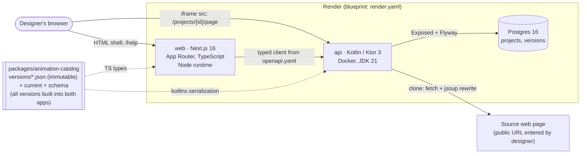

Notes

- The browser talks to both services. The shell and control panel come from `web`; the cloned page is served by `api` so the iframe is cross-origin from the shell and all interaction goes through `postMessage` (section 4).
- `web` never touches the database. The API owns the schema via Flyway.
- The catalog is a build-time dependency of both apps and is also served by `GET /catalog` so the two can be checked for agreement at runtime. Every published catalog version is bundled; a saved assignment pins the version it was authored under, and CSS is always derived from that pinned entry rather than stored.

## 2. Monorepo layout

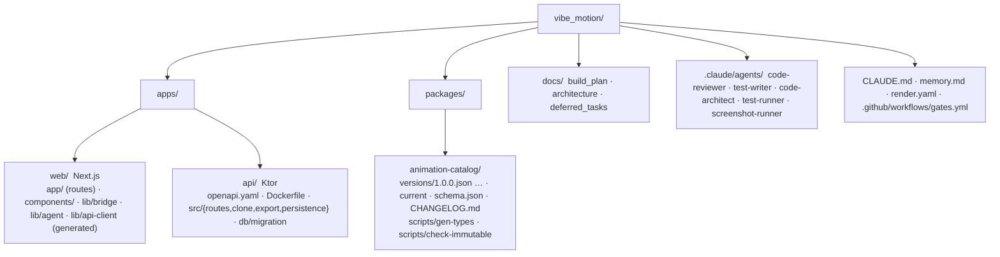

## 3. Request flows

### 3.1 Create project (clone)

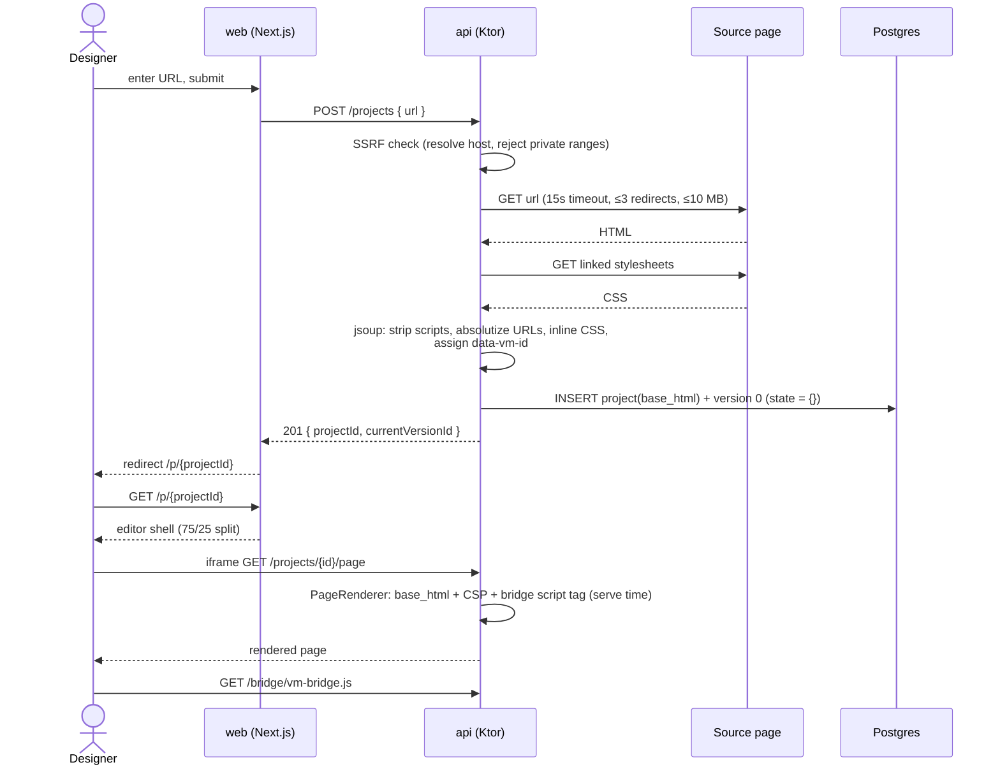

### 3.2 Select an element, apply and tune an animation

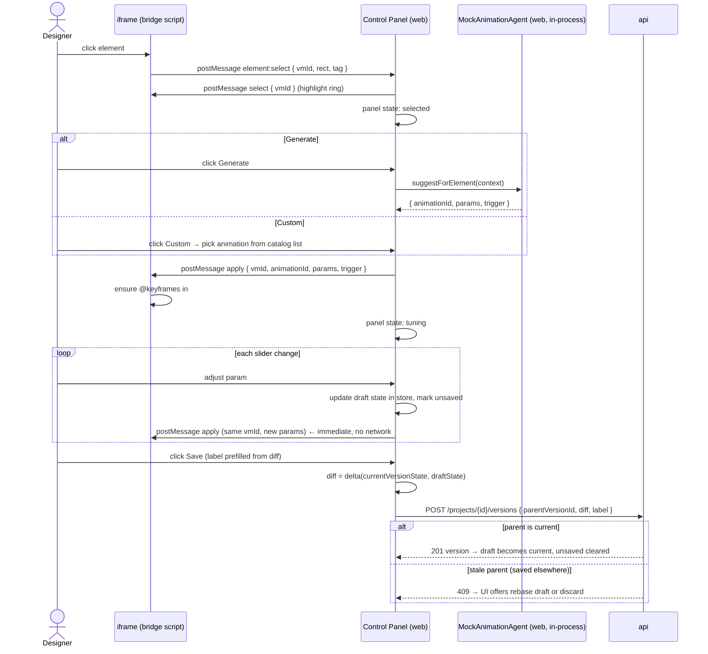

### 3.3 View and restore a version

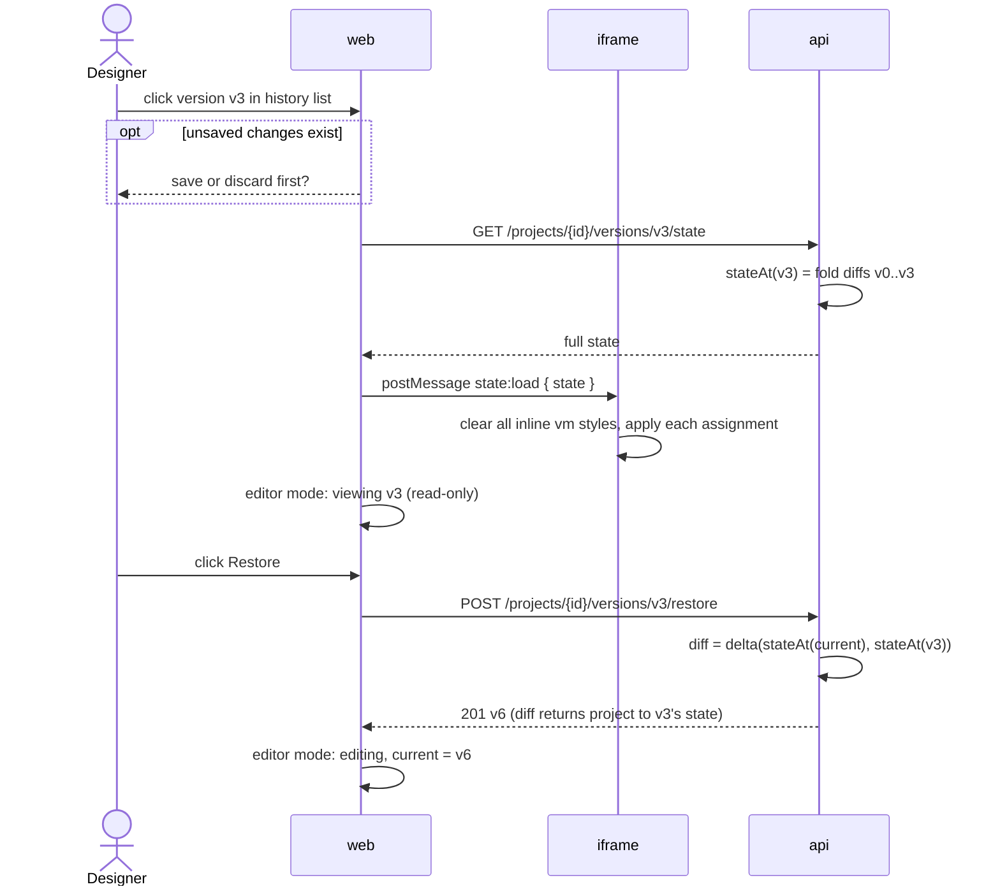

### 3.4 Export

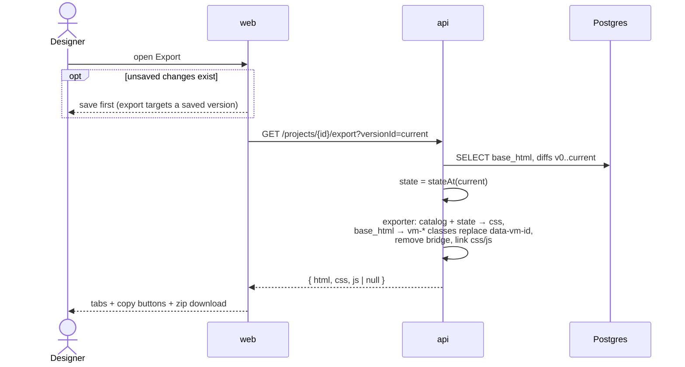

## 4. Preview bridge (iframe ⇄ shell)

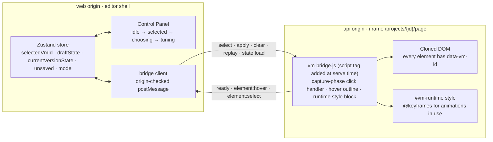

Message envelope: `{ source: "vibe-motion", type, payload }`. Both sides drop messages whose `event.origin` is not in the allow-list injected from environment (`WEB_ORIGIN` for the API, `NEXT_PUBLIC_API_ORIGIN` for the web).

## 5. Data model

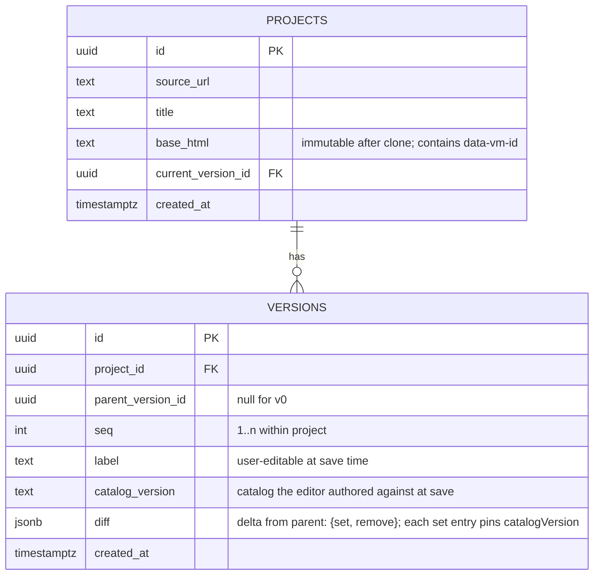

Versions are created only when the user clicks Save. Each stores a diff against its parent; full state is never stored. `stateAt(N)` folds the diffs from v0 (empty) through N.

**CSS is derived, not stored.** An assignment is a reference `(animationId, catalogVersion)` plus `params`. Catalog files are immutable once published, so that reference always resolves to the same keyframes template, and the same generator (browser runtime and Kotlin exporter) produces the same CSS from it. Nothing in Postgres holds CSS text.

`diff` example (one version):

```json
{
  "set": {
    "vm-17": { "animationId": "fade-in-up", "catalogVersion": "1.0.0", "trigger": "load",
               "params": { "duration": "600ms", "delay": "0ms", "easing": "ease-out", "iteration": "1", "distance": "24px" } }
  },
  "remove": ["vm-42"]
}
```

Materialised `state` (what the iframe and exporter consume):

```json
{
  "vm-17": { "animationId": "fade-in-up", "catalogVersion": "1.0.0", "trigger": "load",
             "params": { "duration": "600ms", "delay": "0ms", "easing": "ease-out", "iteration": "1", "distance": "24px" } }
}
```

Resolution to CSS:

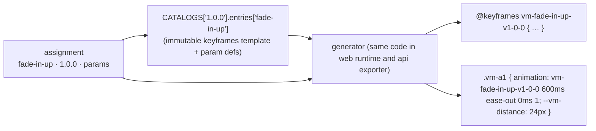

Catalog lifecycle:

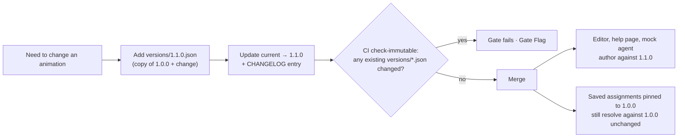

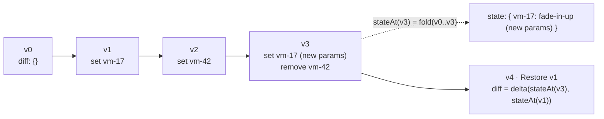

## 6. Deployment (render.yaml)

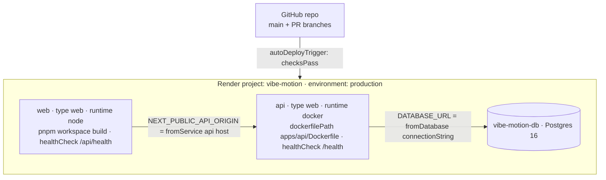

PR preview environments are off (`previews.generation: off`); e2e runs locally against Docker. Secrets (`sync: false`) are entered by Chris in the Render dashboard. Everything else is derived by the blueprint.

## 7. Extension points already reserved

| Future capability | Where it plugs in |
|---|---|
| Real LLM agent | Implements `AnimationAgent`; moves from web to an API endpoint. UI unchanged. |
| Figma / PNG ingestion | New "source adapter" in the clone service producing `base_html`. Everything downstream unchanged. |
| JS / scroll animations | New `trigger` values and an `engine` field on catalog entries (a new major catalog version); exporter grows a JS emitter. |
| Upgrade saved assignments to a newer catalog version | Explicit user action producing a new version whose diff rewrites `catalogVersion` (DT-019). |
| Auth and teams | `owner_id` on `projects`; middleware in both apps. |
