# Vibe Motion — Architecture (v0)

Status: DRAFT for review · Last updated: 2026-09-18

Four views: system context, request flows, data model, and the preview bridge. Decisions referenced here are explained in [build_plan.md](build_plan.md). The designer's journey is in [user_flow.md](user_flow.md).

## 1. System context


Notes

- The browser talks to both services. The shell and control panel come from `web`; the cloned page is served by `api` so the iframe is cross-origin from the shell and all interaction goes through `postMessage` (section 4).
- `web` never touches the database. The API owns the schema via Flyway.
- The catalog is a build-time dependency of both apps and is also served by `GET /catalog` so the two can be checked for agreement at runtime. Every published catalog version is bundled; a saved assignment pins the version it was authored under, and CSS is always derived from that pinned entry rather than stored.

## 2. Monorepo layout

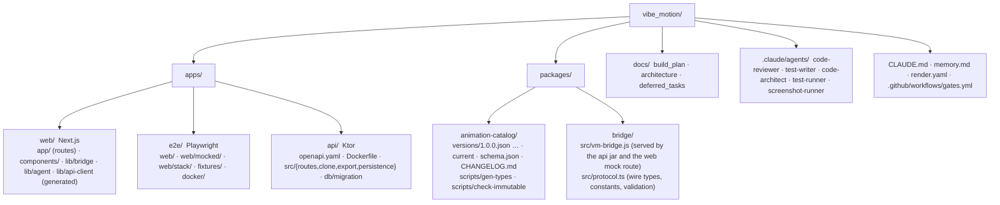

## 3. Request flows

### 3.1 Create project (clone)

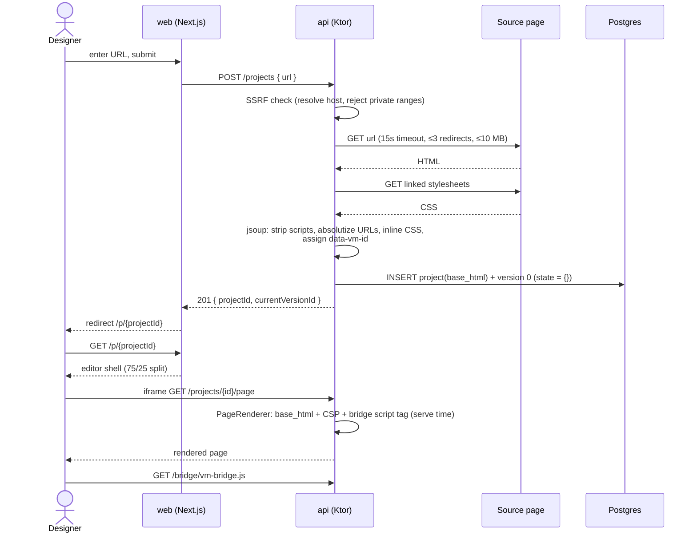

### 3.2 Select an element, apply and tune an animation

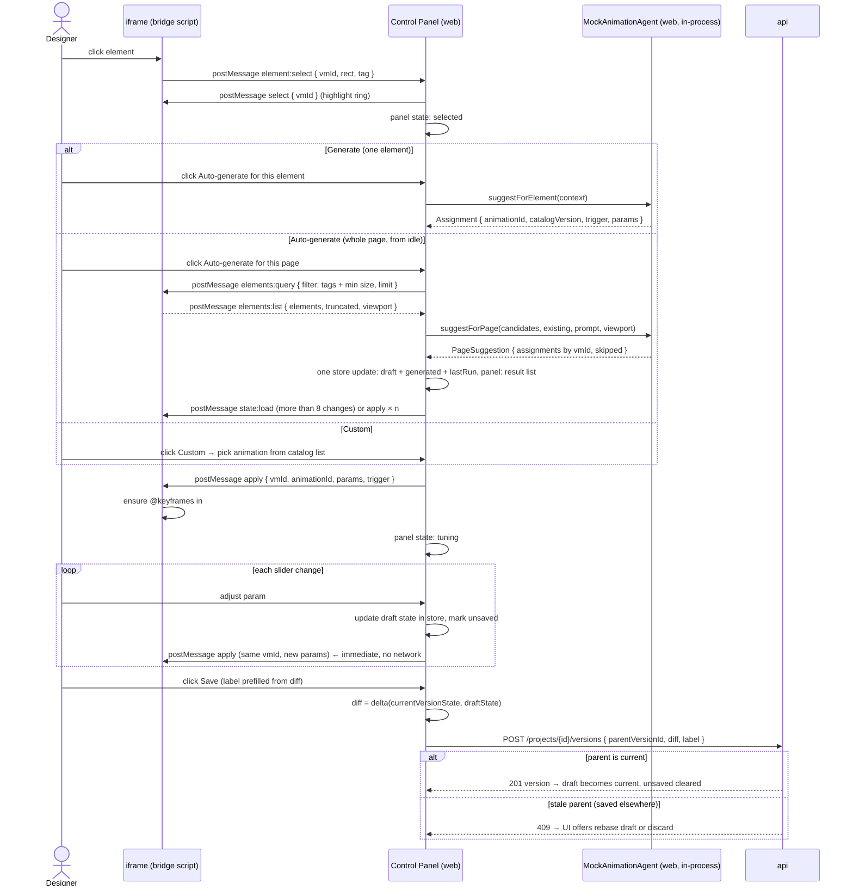

### 3.3 View and restore a version

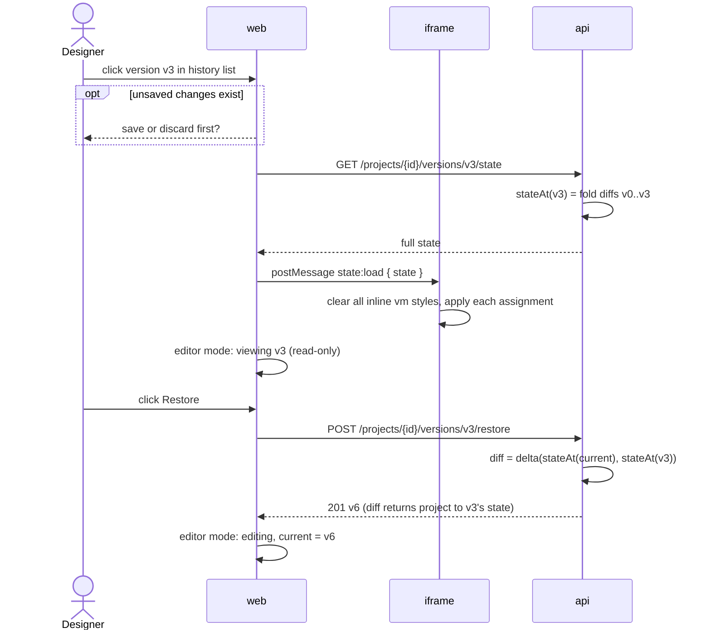

### 3.4 Export

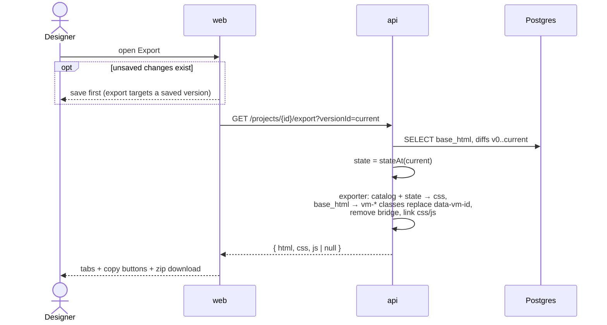

#### Decisions: what makes an exported page inert

An export is served from the designer's own site, with no CSP of ours behind it (DT-073), and
`base_html` is immutable — a row cloned by last month's rewriter is exported with today's
protections because `HtmlSanitiser` runs again on the way out. Two decisions hold that up.

**jsoup is not an oracle for how a browser parses.** The exporter re-parses `base_html` with jsoup
and serialises it again, and for a while the tests then re-parsed that *output* with jsoup and
called it proof. It is not: jsoup builds the same tree from our output that it built from the
input, so a **parser differential** — markup jsoup serialises one way and a browser reads another —
is invisible from there. One got through: a nested `<form>` that jsoup keeps and a browser ignores,
shifting a `<style>` into MathML where it is not a raw-text element and its contents become live
elements. So: **any claim that exported or cloned HTML is inert is proven in a real browser**, over
the hostile corpus in `apps/api/src/test/resources/export/hostile/`, by
`packages/bridge/e2e/export-hostile.spec.ts`. The Kotlin assertions are the fast half, not the
proof. A document whose export is not a fixed point of `emit` is treated as a failure, because
instability is how that differential announced itself.

**Foreign content in cloned pages is reduced to a safe subset.** Inside an `svg` or `math` subtree,
whether an element's contents are text or markup depends on the exact insertion mode, and
re-implementing that is writing a second parser. So `HtmlSanitiser` removes every raw-text HTML
element (`style`, `xmp`, `noembed`, `noframes`, `plaintext`, `noscript`, `iframe`, `script`) found
anywhere in a foreign subtree, HTML integration points included, and removes `<form>` from foreign
content except under an integration point (`foreignObject`, `desc`, `title`, `mtext`, `mi`, `mo`,
`mn`, `ms`), where ordinary HTML rules resume and the form is disarmed like any other.
`annotation-xml` is deliberately **not** treated as an integration point: it is one only for
certain `encoding` values. Nested forms are unwrapped, which is what a browser does with the inner
start tag.

**One narrow exception, because real pages style their inline icons from inside the `<svg>`.** A
`<style>` directly in SVG — not under an integration point, not under `math` — is kept when all
three of these hold: it has no element children, it has no CDATA child, and its *serialised* bytes
contain no `<`. Together those make it impossible for any parser to read the block as markup: `<`
is the only character that can begin a start tag; a source `&lt;` is decoded to text while parsing
and written back as `&lt;`, so it never becomes one; a literal `<` never reaches the check at all,
because jsoup builds an element out of it and the first condition has already refused; and a CDATA
section is a second syntax whose own delimiters carry `<`. A kept block is still swept like any
other — dangerous `url()` defused, and on the clone path its URLs absolutised. Everything else in
foreign content still goes. Dropping the lot was the first rule here and it was too wide: it kept
the corpus inert and quietly unstyled every inline icon, a fidelity cost far broader than the
threat. Both halves are proved in Chromium over the corpus — the hostile documents stay inert, and
a benign icon's computed `fill` and `stroke` still come from its own block.

## 4. Preview bridge (iframe ⇄ shell)

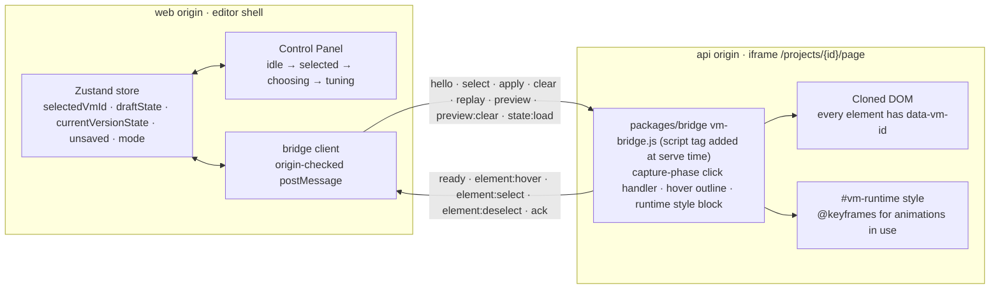

Message envelope: `{ source: "vibe-motion", type, payload, seq? }`. Both sides drop a message unless its `event.origin`, its `event.source` and its envelope shape all pass; the allowed origin is injected from environment (`WEB_ORIGIN` for the API, which the page renderer writes into `data-vm-parent-origin`; the framed page's own origin for the web). `"*"` is never a `targetOrigin` on either side.

Four things the sketch above leaves out, all of them contract
([phase-4-bridge-protocol.md](plans/phase-4-bridge-protocol.md)):

- **Handshake.** `ready` carries `protocolVersion`. The shell sends `hello` when its client mounts *and* on the iframe's `load` event, and the bridge answers every `hello` with a fresh `ready` — the shell is server-rendered, so the frame's first `ready` can be posted before the shell is listening. A `protocolVersion` the shell does not know stops it sending anything and shows a reload banner.
- **`ack`.** Every shell→iframe message carries a `seq` and is answered with `ack { seq, ms, ok }`, where `ms` is the time the bridge spent in the handler. That is what the performance budget is measured against, and what tests await instead of a timer.
- **`preview` is not `apply`.** Hovering a card in the picker shows an animation transiently, on top of whatever is applied and without touching the draft; `preview:clear` restores what was underneath. The shell owns that preview's whole lifetime and must end it — a preview left behind masks every later `apply`.
- **The mock page is cross-origin too.** In mock mode the shell serves itself from one loopback name and frames the other (`localhost` ⇄ `127.0.0.1`, same Next server, same port), with the API's own CSP and the same `packages/bridge` script. A same-origin mock would let a bridge that skipped its origin check pass e2e.

## 5. Data model

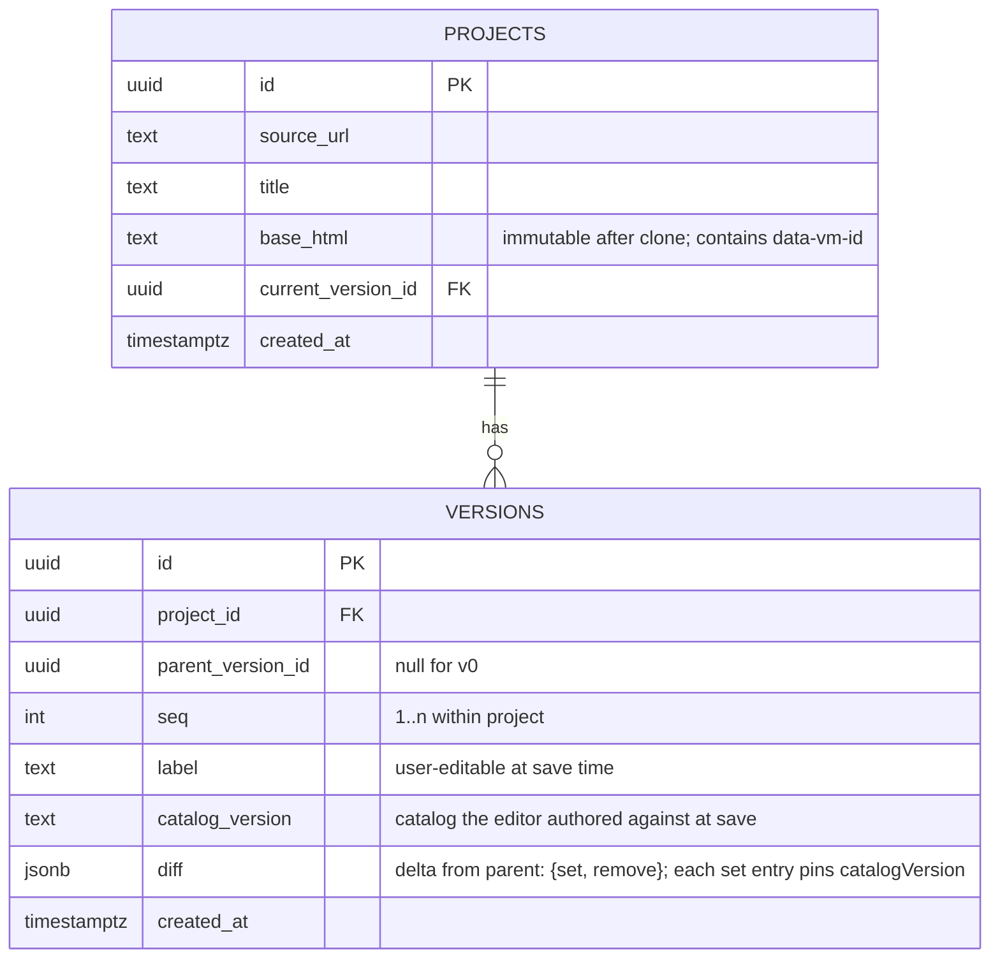

Versions are created only when the user clicks Save. Each stores a diff against its parent; full state is never stored. `stateAt(N)` folds the diffs from v0 (empty) through N.

**CSS is derived, not stored.** An assignment is a reference `(animationId, catalogVersion)` plus `params`. Catalog files are immutable once published, so that reference always resolves to the same keyframes template, and the same generator (browser runtime and Kotlin exporter) produces the same CSS from it. Nothing in Postgres holds CSS text.

`diff` example (one version):

```json
{
  "set": {
    "vm-17": { "animationId": "fade-in-up", "catalogVersion": "1.0.0", "trigger": "load",
               "params": { "duration": "600ms", "delay": "0ms", "easing": "ease-out", "iteration": "1", "distance": "24px" } }
  },
  "remove": ["vm-42"]
}
```

Materialised `state` (what the iframe and exporter consume):

```json
{
  "vm-17": { "animationId": "fade-in-up", "catalogVersion": "1.0.0", "trigger": "load",
             "params": { "duration": "600ms", "delay": "0ms", "easing": "ease-out", "iteration": "1", "distance": "24px" } }
}
```

Resolution to CSS:

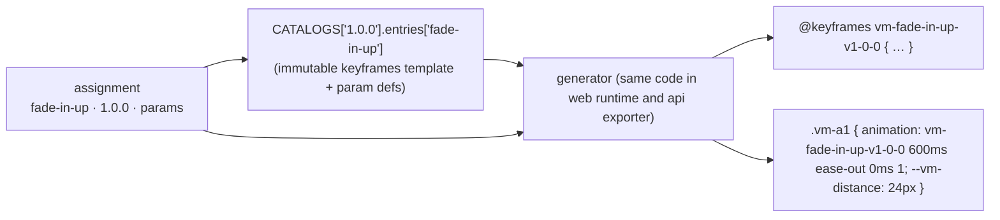

Catalog lifecycle:

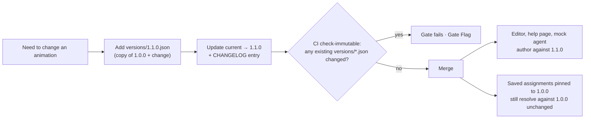

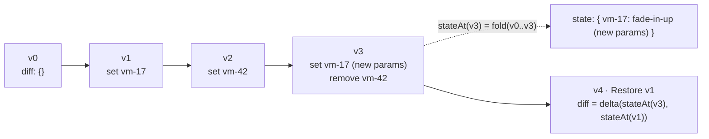

## 6. Deployment (render.yaml)

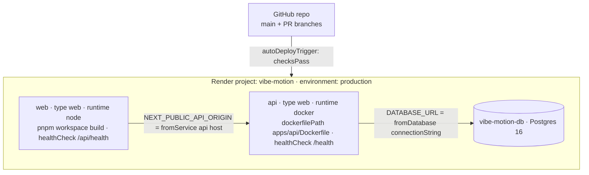

PR preview environments are off (`previews.generation: off`); e2e runs locally against Docker. Secrets (`sync: false`) are entered by Chris in the Render dashboard. Everything else is derived by the blueprint.

## 7. Extension points already reserved

| Future capability | Where it plugs in |
|---|---|
| Real LLM agent | Implements `AnimationAgent`; moves from web to an API endpoint. UI unchanged. |
| Figma / PNG ingestion | New "source adapter" in the clone service producing `base_html`. Everything downstream unchanged. |
| JS / scroll animations | New `trigger` values and an `engine` field on catalog entries (a new major catalog version); exporter grows a JS emitter. |
| Upgrade saved assignments to a newer catalog version | Explicit user action producing a new version whose diff rewrites `catalogVersion` (DT-019). |
| Auth and teams | `owner_id` on `projects`; middleware in both apps. |
