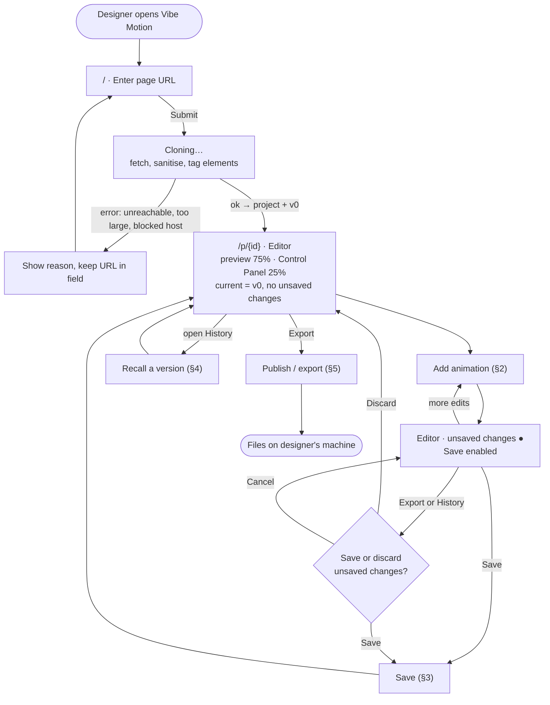
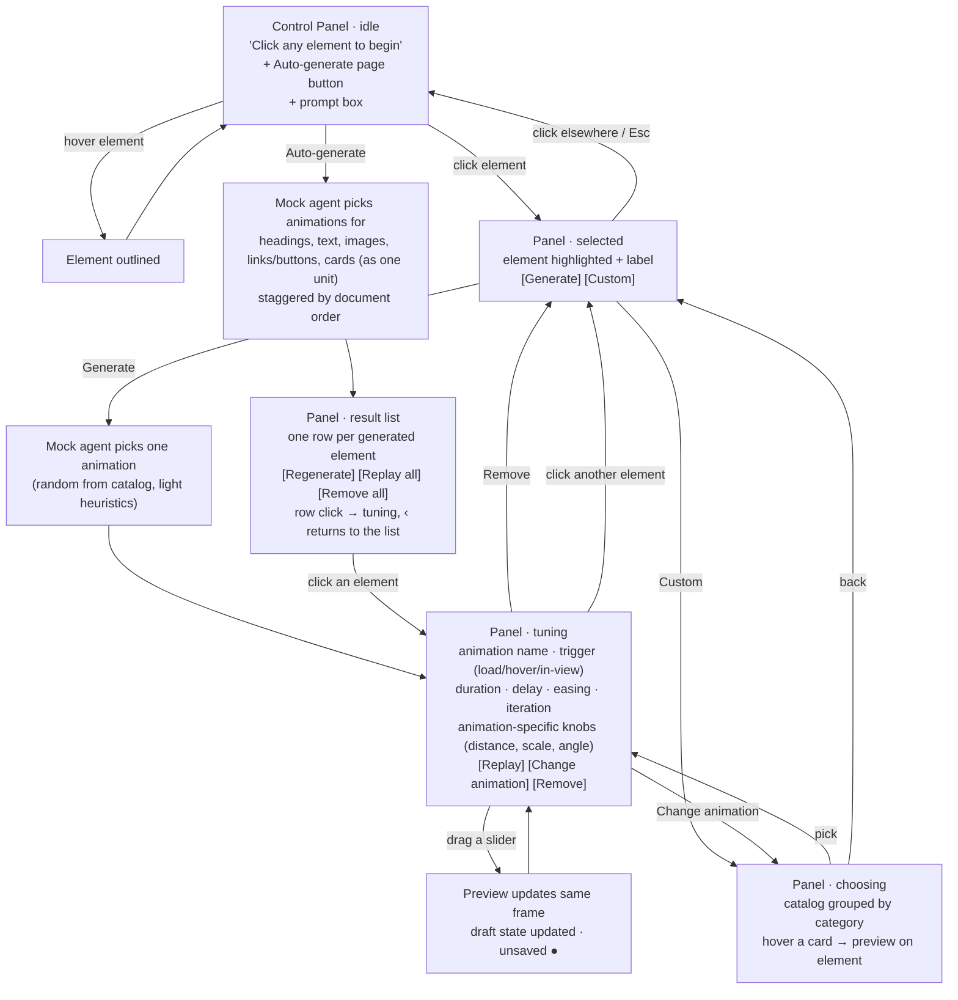
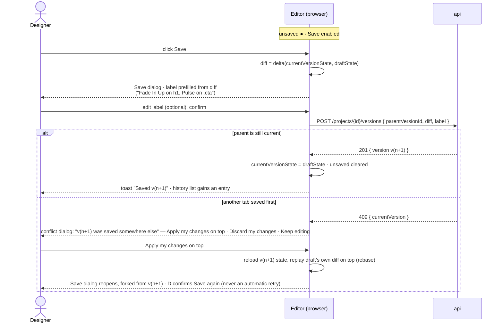
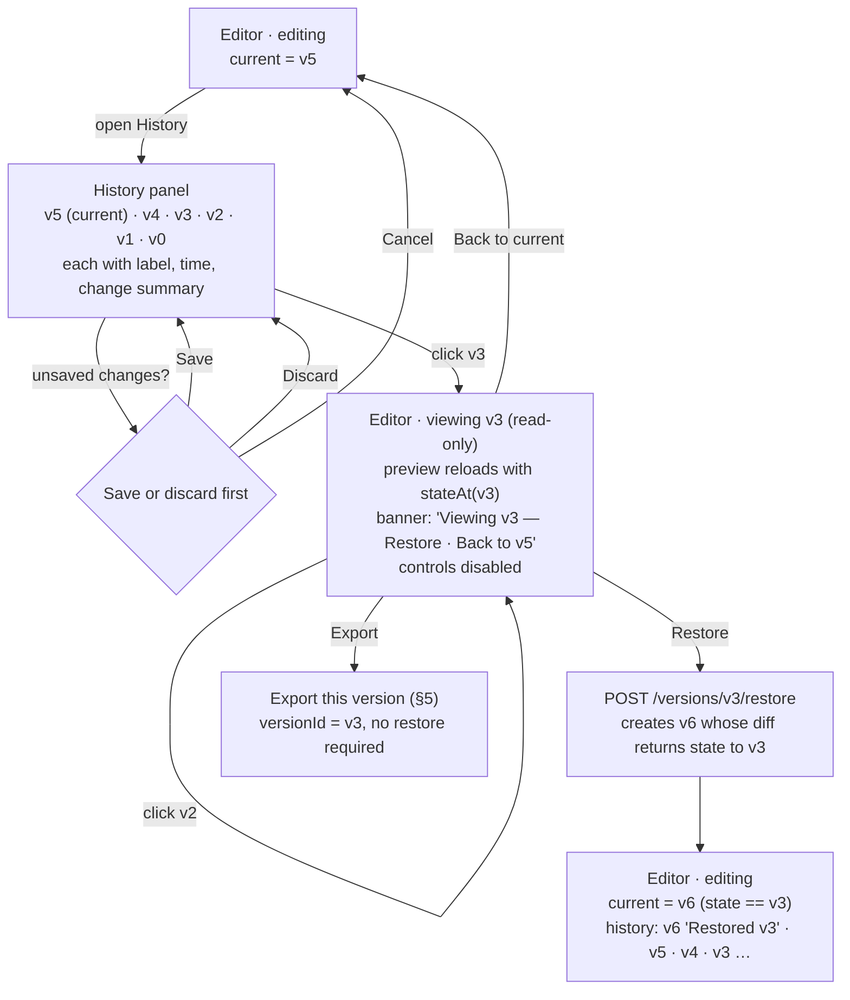
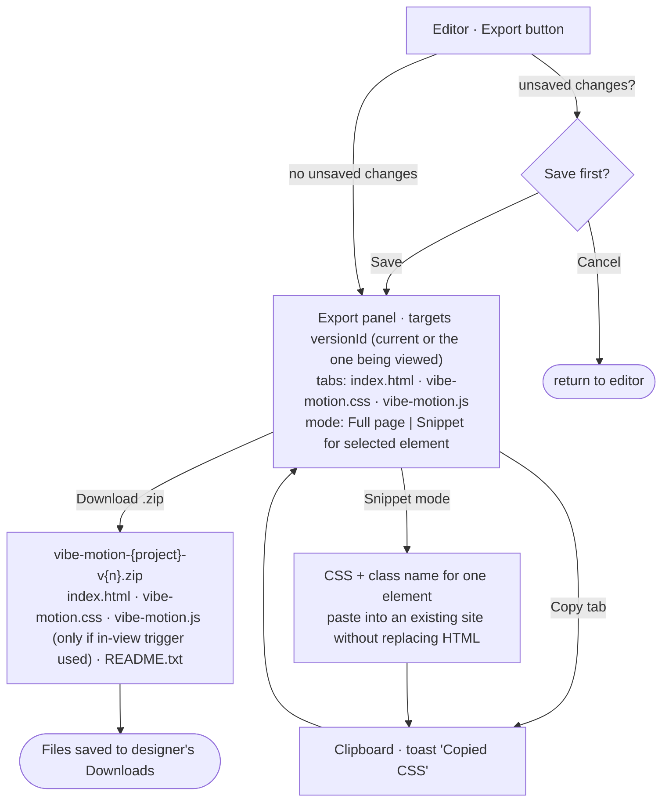

# Vibe Motion — User Flow (v0)

Status: DRAFT for review · Last updated: 2026-09-18

The designer's journey end to end: capture a page, add animation, save a version, recall an earlier version, export to their machine. Screens map to routes in [build_plan.md](build_plan.md) Phase 3; data behaviour maps to [architecture.md](architecture.md).

## 1. End-to-end journey

## 2. Adding animation

Notes

- Nothing in this section calls the API. Every change updates the draft in the browser and the preview iframe.
- "Generate" and "Auto-generate" are the mock agent in v0. Auto-generate and Regenerate keep hand-tuned work and re-roll only what the agent made and the user has not touched; switching elements away from untouched agent work never raises the unsaved-changes dialog, while the top bar's Unsaved indicator still shows. The prompt box is present and passed into the agent context but ignored by the mock; a tooltip says so.
- "Help" is reachable from the panel header at any time and opens `/help` in a new tab so the draft is untouched.

## 3. Saving a version

- Versions exist only through Save. Sliding a control fifty times and saving once yields one version.
- Each version stores only the diff from its parent, so the history list can show exactly what changed in each entry.

## 4. Recalling a previous version

- Restoring never deletes or rewrites history. v4 and v5 remain and can be viewed or restored later.
- Any saved version can be exported directly while viewing it, without restoring.
- Pressing Esc, or switching away from the History tab, returns to the current version the same way "Back to current" does. Save and Cancel are hidden (not merely disabled) for the whole time the editor is viewing — there is no draft of the viewer's own to save or cancel.

## 5. Publishing (export) to the local machine

`README.txt` in the zip explains the three files, how to link the CSS and JS, and which classes were added to which elements.

## 6. State summary

| Editor mode | Preview shows | Controls | Save | Export target |
|---|---|---|---|---|
| editing, clean | current version | enabled | disabled | current |
| editing, unsaved ● | draft | enabled | enabled | prompts to save |
| viewing vN | stateAt(vN) | disabled | hidden | vN |
| cloning | spinner | none | none | none |
